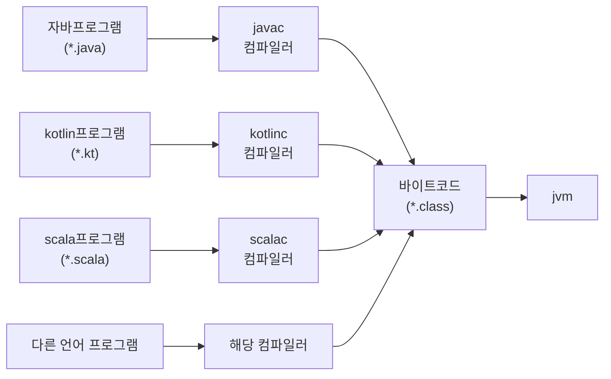

# 클래스 파일 구조

**jvm의 독립성**
1. 플랫폼 독립성

    jvm이 다양한 플랫폼을 지원하고, 모든 가상 머신이 동일한 프로그램 저장 형식(바이트코드)을 지원

2. 언어 독립성
    
    어떤 프로그래밍 언어에도 종속적이지 않는 특징.
    
    오늘날 코틀린, 클로저, 그루비, JPython 등 자바 가상 머신에서 동작하는 수만은 언어를 개발.

    언어 독립성을 보장하는 핵심은 가상 머신과 바이트코드 저장 형식이다. 

    자바 가상 머신은 언어에 종속적이지 않고 `클래스 파일` 이라는 특정 바이너리 파일 형식에만 종속적이다. 

    어떤 언어든 컴파일러를 통해 클래스 파일로만 변환하기만 하면 jvm위에서 구동이 가능하다. 




## 클래스파일 구조
모든 클래스파일은 각각 하나의 클래스 또는 인터페이스를 정의한다. 클래스파일은 바이트를 하나의 단위로 하는 이진 스트림 집합체이다. 각 데이터 항목이 정해진 순서에 맞게 구분 기호 없이 나열된다. 

클래스나 인터페이스를 꼭 파일에 담아둘 필요는 없다. 동적으로 생성해 클래스 로더에 직접 제공할 수 있다. 

### 데이터 타입
- 부호 없는 숫자: 기본 데이터 타입을 표시한다. 숫자, 인덱스 참조, 수량 값을 기술하거나 문자열 값을 구성할 수 있다. u1(1byte), u2(2byte), ...
- 테이블: 여러개의 부호 없는 숫자나 또 다른 테이블로 구성된 복합 데이터 타입을 표현한다. 테이블 이름은 관례적으로 '_info'로 끝난다. 


```
ClassFile {
    u4             magic;
    u2             minor_version;
    u2             major_version;
    u2             constant_pool_count;
    cp_info        constant_pool[constant_pool_count-1];
    u2             access_flags;
    u2             this_class;
    u2             super_class;
    u2             interfaces_count;
    u2             interfaces[interfaces_count];
    u2             fields_count;
    field_info     fields[fields_count];
    u2             methods_count;
    method_info    methods[methods_count];
    u2             attributes_count;
    attribute_info attributes[attributes_count];
}
```
https://docs.oracle.com/javase/specs/jvms/se7/html/jvms-4.html#jvms-4.1

#### magic
  매직 넘버는 가상 머신이 허용하는 클래스 파일인지 여부를 빠르게 확인하는 용도로만 쓰인다. 클래스 파일의 매직넘버는`0xCAFEBABE`이다. 

#### 버전 번호
  마이너 버전 번호는 JDK 1.x 이전에 잠시 사용되었었다. 1.2부터는 사용하지 않아 0으로 고정되어 있다. 한편 JDK12에서 일부 새 기능을 베타 출시할 때 활용한 이력이 있다. 

#### 상수 풀
  https://docs.oracle.com/javase/specs/jvms/se7/html/jvms-4.html#jvms-4.4
  Java Virtual Machine 명령어는 클래스, 인터페이스, 클래스 인스턴스 또는 배열의 런타임 레이아웃에 의존하지 않습니다. 대신 명령어는 Constant_pool 테이블의 기호 정보를 참조합니다.

상수풀에 담기는 상수 유형
- 리터럴: 자바 언어 수준에서 이야기하는 상수와 비슷한 개념
- 심벌 참조: 컴파일과 관련된 개념으로 1) 모듈에서 export, import 하는 패키지, 2) class와 interface의 완전한 이름, 3) 필드/메서드 이름과 서술자, 4) 메서드 핸들과 메서드 타입, 5)동적으로 계산되는 호출 사이트와 상수

```
cp_info {
    u1 tag;
    u1 info[];
}
```

tag별로 info의 타입 구조가 다르다. 

> 자바 코드를 javac로 컴파일 할 때는 c, c++ 와 달리 링크 단계가 없다. 자바에서 링크는 가상 머신이 클래스 파일을 로드할 때 동적으로 이루어진다. 필드와 메서드가 메모리에서 어떤 구조로 표현되는가에 관한 정보는 클래스 파일에 저장되지 않는다는 뜻이다. p296

#### 접근 플래스
현재 클래스 파일이 표현한느 대상이 클래스인지, 인터페이스 인지, public인지 등의 정보를담는 2바이트 플래그 이다. 


#### 클래스 인덱스(this_class), 부모 클래스 인덱스(super_class), 인터페이스 인덱스(interfaces)
클래스 파일의 상속 관계를 규정한다. 

#### 필드 테이블
인터페이스나 클래스 안에 선언된 변수들을 설명하는데 쓰인다. 
자바 언어에서 필드란 클래스 변수와 인터페이스 변수를 뜻한다. 메서드 안에 선언된 지역변수는 필드가 아니다. 

#### 메서드 테이블
메서드에 선언된 변수들을 설명하는데 쓰인다. 

#### 속성 테이블(attribute_info)

## 바이트코드 명령어
자바 가상 머신의 명령어 = 연산코드 + 피연산자

명령어 대부분이 피연산자 없이 연산코드 하나로 구성되며, 피연산자는 피연산자 스택에 저장된다. 

연산코드의 길이가 `1byte`로 제한되기 때문에 최대 256개의 연산 코드만 표현할 수 있다. 그래서 자주 쓰이는 연산과 데이터 타입 조합네만 전용 명령어를 배정했다. 전용 명령어가 없는 타입은 별도 지시문을 이용해 지원되는 타입으로 변환해 사용한다. (ex. byte, short는 int로 부호 확장해 int 타입 바이트코드 명령어를 사용하도록 한다.)
[opcode 종류](https://docs.oracle.com/javase/specs/jvms/se7/html/jvms-7.html)

> 클래스파일 구조에서는 컴파일된 코드에 들어 있는 피연산자의 길이 정렬을 허용하지 않단다. 따라서 1바이트가 넘는 ~~ 재구성 해야한다. 339


```
do{
    PC레지스터의 값을 자동으로 계산한다 
    바이트코드 스트림에서 PC레지스터가 가리키는 위치의 연산 코드를 가져온다
    (피연산자가 필요한 바이트코드라면) 바이트코드 스트림에서 피연산자를 가져온다
    연산 코드가 정의하는 동작을 수행한다
} while(바이트코드 스트림 길이 >0);
```
